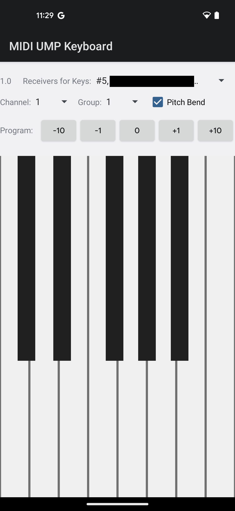

MidiUmpKeyboard
============

Simple on-screen keyboard that can send Note On, Note Off, Program
 Change, and Per Note Pitch Bend messages to MIDI 2.0 devices.

This app first tries MIDI-CI.
If MIDI-CI is successful, it will act as a MIDI 2.0 keyboard that can send
MIDI 2.0 Note On, Note Off, Program Change, and Per Note Pitch Bend messages.

Select the target device from the spinner menu.

This app will NOT work on MIDI devices that do not support MIDI 2.0 over USB.

Images
-----------

The connected USB MIDI device has yet to be released so its name is censored out.
