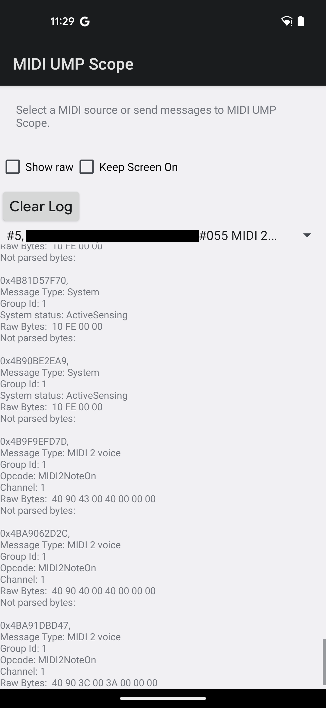

MidiUmpScope
============

Display MIDI UMP messages from a peripheral as they are received on the screen in
a scrolling list.

This application will also attempt to connect to the peripheral with MIDI-CI.

If MIDI-CI is successful, this application will act like a synth.
It will react to MIDI 2.0 Note On, Note Off, Pitch Bend, and Program Change messages.

This app will NOT work on MIDI devices that do not support MIDI 2.0 over USB.

Images
-----------

The connected USB MIDI device has yet to be released so its name is censored out.
